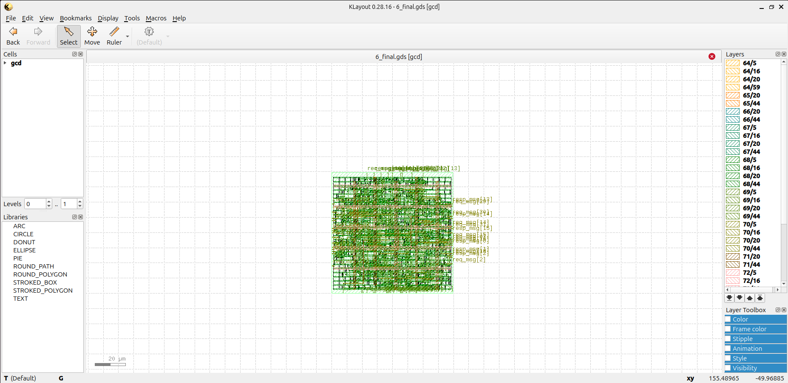

# Week 5 — OpenROAD Flow Setup and Floorplan + Placement

## Objective
Set up the OpenROAD Flow Scripts environment and execute the **Floorplan** and **Placement** stages on the `gcd` design using the **Sky130 HD PDK**.  
This marks the transition from logic-level RTL to backend physical implementation in the RISCV project workflow.

---

## 1. OpenROAD Installation and Setup

Cloned the OpenROAD Flow Scripts repository and built OpenROAD locally inside a Linux (Ubuntu) container environment.  
The build was verified with version output after successful compilation.

```bash
# Clone OpenROAD Flow Scripts
git clone https://github.com/The-OpenROAD-Project/OpenROAD-flow-scripts.git
cd OpenROAD-flow-scripts

# Build OpenROAD locally
cd tools/OpenROAD
mkdir build && cd build
cmake ..
make -j6

# Verify installation
/OpenROAD-flow-scripts/tools/install/OpenROAD/bin/openroad -version
```
Screenshot:

---

## 2. Running the OpenROAD Flow

Executed the standard OpenROAD flow using the provided flow.tcl script and configuration files.
The run was limited strictly to Floorplan and Placement stages (as per the Week 5 task).

```bash
# Navigate to flow directory
cd /OpenROAD-flow-scripts/flow

# Run the OpenROAD flow up to placement
make DESIGN_CONFIG=./designs/sky130hd/gcd/config.mk
```
Screenshot:


---

## 3. Floorplan Stage

Opened the generated 6_final.gds in KLayout to visualize the die/core area and confirm the floorplan boundaries.

Screenshot:


## 4. Placement Stage

Zoomed in to verify standard-cell placement. Observed multiple req_msg and resp_msg nets — clear indication of correct placement.

Screenshot:

---

## Summary

Installed and built OpenROAD Flow Scripts successfully in a Linux container.
Ran the flow for the gcd design using the Sky130 HD PDK up to the Floorplan and Placement stages.
Verified die/core area and standard-cell placement in KLayout.
Resolved dependency errors during compilation by reinstalling GCC and CMake.
